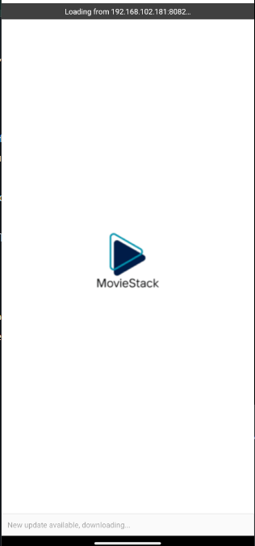
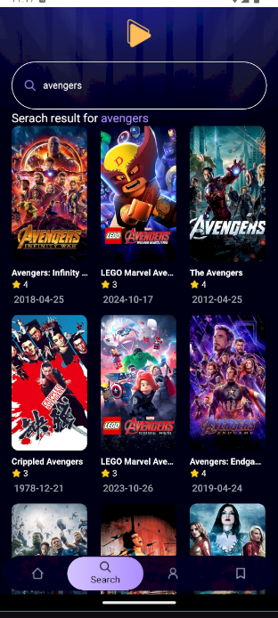
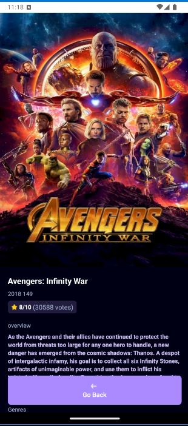
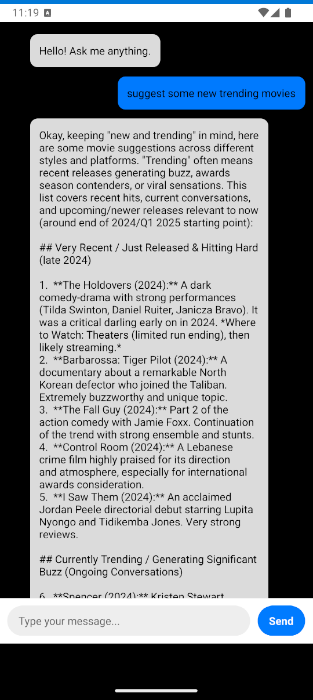

# 🎬 MovieStack

**MovieStack** is a cross-platform mobile app built with **React Native + Expo** that lets users explore, search, and get movie recommendations powered by **AI**. It fetches data from the **TMDB API**, integrates **OpenRouter’s GPT-4o** for movie suggestions, and uses **Appwrite** for backend services.

---

## 🚀 Features

- 🔍 **Search Movies & Series** from the TMDB API
- 🎞️ **Trending Movies Carousel** for quick discovery
- 🤖 **AI-Powered Chatbot** using OpenRouter (GPT-4o)
- 🌌 **Stylish UI** with Tailwind-powered layout (NativeWind)
- ☁️ **Appwrite Integration** for backend functionality

---

## 🔧 In Development

- 👤 **User Profiles** using Appwrite Authentication
- 📝 **Watchlist & Favorites** saving to Appwrite database
- 📊 **Personalized Suggestions** via recent search history
- 🌓 **Dark/Light Theme Toggle**

---

## 🖼️ Screenshots

> All screenshots are stored in the `/assets` folder.

### 🟣 Splash Screen

### 🏠 Home Screen

### 🔍 Search Screen

### 🎬 Movie Details Screen

### 🤖 AI Chat Screen

---

## 📦 Tech Stack

| Layer        | Tech Used               |
|--------------|--------------------------|
| Framework    | React Native + Expo      |
| Styling      | Tailwind CSS (NativeWind)|
| API          | TMDB API                 |
| AI Assistant | OpenRouter (GPT-4o)      |
| Backend      | Appwrite BaaS            |

---

## 📁 Folder Structure

